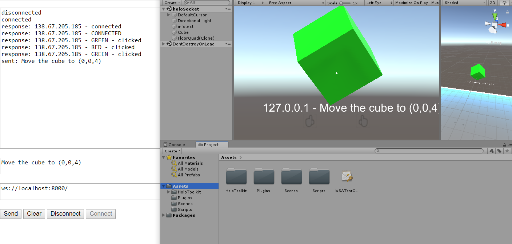

# A WebSocket implementation between UWP and Multi-platform devices

<p align = "center">
    
</p>

## UWP/HoloLens side:

- Clone the repository and open it in Unity 2018+
- Change the URI in `Scripts/TestWebsocketSender.cs` to your websocket server.

    `websocket = new WebSocket("ws://192.67.205.185:8000/");`

- Build in Unity and then Deploy application to device using Visual Studio 2017.
- HoloLens will display whatever message you send from the server.

## Websocket Server/Client
- There are many options to quickly implement a Websocket server:
### Python
- Create a new virtual environment (e.g., `virtualenv`)
- Install the necessary pip packages (see `/python-websocket/requirements.txt`)
- Run either
    - `python echo_socket_server.py` (echo all interaction gestures from the HoloLens via websocket)
    - `python chat_server.py` (send and receive data between your server and HoloLens via websocket).
- Or follow this guide: https://github.com/dpallot/simple-websocket-server


### NodeJS:
- Download and install NodeJS: https://nodejs.org/en/
- Create a websocket_server.js script like the example below then run `node websocket_server.js`

```
  var ws   = require ('ws').Server;

  var wss = new ws ({port: 8000});


  wss.broadcast = function (data) {
      for (var i in this.clients) {
          this.clients [i].send (data);
      }
  };

  wss.on ('connection', function (ws) {
      //wss.broadcast ("Node is UP");
      ws.on ('message', function (message) {
          var now = new Date();
          console.log (now.toLocaleString() + ' Received: %s', message);
          wss.broadcast (message);
      });

  });

```


In progress...
